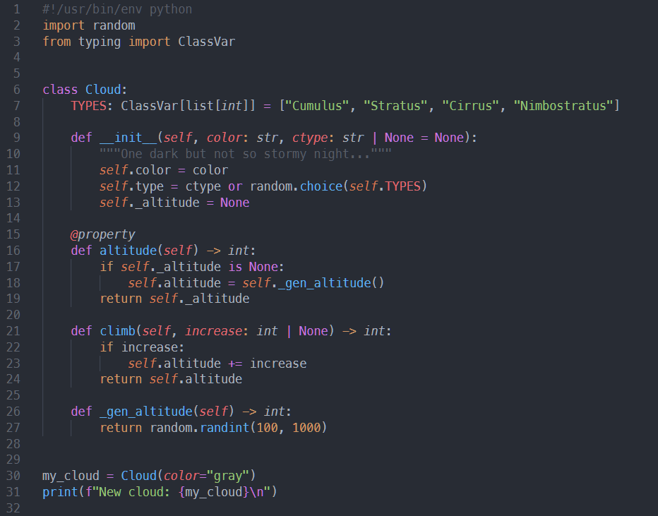

# One Dark Cloud Theme

Dark theme for VSCode inspired by Atom's [One Dark Theme](https://github.com/atom/atom/tree/master/packages/one-dark-syntax) with tweaks to make it feel "soft" and "plushy" on the eyes!

Includes progressive coloring for up-to 8 `.json` levels.



## Install

In VSCode, open the command palette and run:

```
ext install one-dark-cloud-theme
```

or directly from CLI:

```
code --install-extension one-dark-cloud-theme
```
